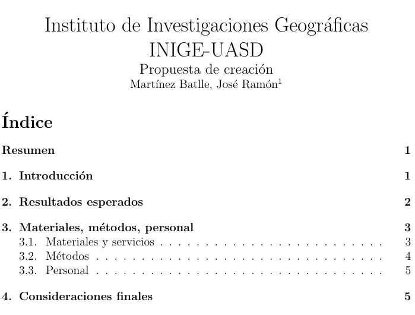

```{r setup, include=FALSE}
knitr::opts_chunk$set(echo = FALSE)
```

## Global
- Misión: aportar **nuevo conocimiento** en geografía
- Enfoque: investigar con **escasos recursos** usando **herramientas libres** y métodos **reproducibles**.
- Vigencia de la primera propuesta de acción: **un año** a partir del momento de su creación

## Documento **"Propuesta de creación"**
- Proponer una estructura de investigación **nueva y dinámica**
- Proponer **resultados**
<center>

</center>
<span style="font-size:70%;">URL: [https://github.com/geofis/inige/blob/master/propuesta.pdf](https://github.com/geofis/inige/blob/master/propuesta.pdf)</span>

## Resultados esperados
- $n\times 2$ publicaciones (e.g. $5 \times 2=10$) científicas producidas.
- $n \times 2$ presentaciones realizadas en eventos científicos
- $N$ documentos de preproducibilidad/reproducibilidad con los resultados alcanzados y los métodos aplicados \
\
\
<div style="text-align: center"> **$N=$ número de investigaciones (¿proyectos?) en marcha** </div>
\
<div style="text-align: center"> **$n=$ número de investidorxs** </div>

## Estructura propuesta
- Para el primer año, número de **investigadorxs** entre 3 y 5, **del área docente**. **NO EMPLEADOS EN ESTOS PUESTOS**
- Exigencia de publicar al menos dos estudios por año en revistas científicas o en servidores de prepublicaciones
- Posibilidad de contratación externa
- Un (1, la unidad, singular) secretario/a
